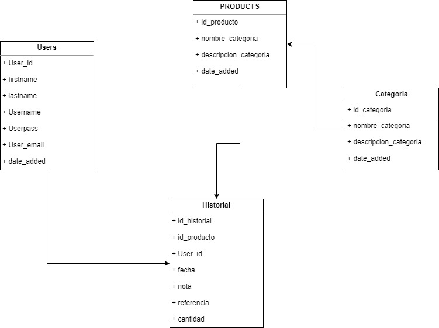

# SISTEMA WEB PARA LE GESTION DE INVENTARIO
## INTRODUCCION
En el presente proyecto, se propone implementar un sistema web para mejorar la gestión de inventario 
facturación, que proporcione a los usuarios, una herramienta que facilite la búsqueda, adquisición,
 venta y facturación de productos y servicios tecnológicos, mediante la utilización de tecnología de 
información y comunicación.

Se encuentra elaborado bajo diseño CSS3, HTML5 y JAVASCRIPT, junto con MYSQL, haciendo 
uso de la arquitectura de tres capas (MVC) que garantiza la calidad en el desarrollo, haciendo que el 
sistema sea robusto, flexible y amigable para el usuario final.

En conclusión, se elaboró la propuesta en base a los juicios y fundamentos obtenidos de la 
observación del proceso al momento de facturar en la empresa y la opinión de algunos usuarios los 
que serán quienes utilicen el sistema, se recogió sus opiniones a través de una entrevista aplicada 
para realizar el proyecto de mejor manera identificando aspectos que sirvan para esquematizar, 
diseñar e implementar el sistema propuesto y que garantice la usabilidad y facilidad del mismo a 
largo plazo.
## FUNCIONALIDADES PRINCIPALES
Generación alerta de existencias y existencias críticas para el reabastecimiento.
## Casos de uso

## Maqueta del proyecto

## INSTALACION
"# proyecto1" 

Simple Stock (Inventario Simple) es un sistema web desarrollado con PHP, MySQL y Bootstrap, que cubre una serie de 
requerimientos básicos para llevar el control del inventario de una empresa o negocio. Esta es  una solución sencilla 
para que los propietarios de pequeñas empresas gestionen sus existencias de manera sistemática, y de esa manera poder 
reemplazar el uso de hojas de calculo para gestionar  su inventario.

Instalación en windows (servidor local)

1- Descargar los archivos fuentes del sistema

2- Copiar y descomprimir el archivo en la carpeta c:\xampp\htdocs, al final tendras una carpeta llamada “proyecto1”, a la cual podrás acceder desde el navegador como: http://localhost/proyecto1/

3- Crear una base de datos usando PHPMyAdmin accediendo a la url siguiente: http://localhost/phpmyadmin/

4- Importar las tablas de la base de datos para ello vamos a buscar el archivo "simple_stock.sql" en el directorio root de nuestro sistema, una vez localizado procedemos a hacer la importación de los datos desde PHPMyAdmin

5- Configurar los datos de conexión a la base de datos editando el archivo de configuración que se encuentra en la siguiente ruta: simple_stock/config/db.php

6- Datos de acceso por defecto: usuario: admin y contraseña: 061085Ra.
## DISEÑO BASE DE DATOS

## Lista de servisios

//Categoria
GET http://localhost/proyecto/api/v1/Categoria.php
POST http://localhost/proyecto/api/v1/Categoria.php
PUT http://localhost/proyecto/api/v1/Categoria.php?id=:id
PATCH http://localhost/proyecto/api/v1/Categoria.php?id=:id&campo=:campo
DELETE http://localhost/proyecto/api/v1/Categoria.php?id=:id

//Usuario
GET http://localhost/proyecto/api/v1/Usuario.php?id=:id
POST http://localhost/proyecto/api/v1/Usuario.php
PUT http://localhost/proyecto/api/v1/Usuario.php?id=:id
PATCH http://localhost/proyecto/api/v1/Usuario.php?id=:id&campo=:campo
DELETE http://localhost/proyecto/api/v1/Usuario.php?od=:id
POST http://localhost/proyecto/api/v1/Usuario.php?metodo=login
POST http://localhost/proyecto/api/v1/Usuario.php?metodo=logout

//Productos
GET http://localhost/proyecto/api/v1/Producto.php
POST http://localhost/proyecto/api/v1/Producto.php
PUT http://localhost/proyecto/api/v1/Producto.php?id=:id
PATCH http://localhost/proyecto/api/v1/Producto.php?id=:id&campo=:campo
DELETE http://localhost/proyecto/api/v1/Producto.php?id=:id
GET http://localhost/proyecto/api/v1/Producto.php?campo=:campo&filter=:filter&paginator=:paginator

//Historial
GET http://localhost/proyecto/api/v1/Historial.php
POST http://localhost/proyecto/api/v1/Historial.php
PUT http://localhost/proyecto/api/v1/Historial.php?id=:id
PATCH http://localhost/proyecto/api/v1/Historial.php?id=:id&campo=:campo
DELETE http://localhost/proyecto/api/v1/Historial.php?od=:id

## URL REPOSITORIO
https://github.com/atorrico69/proyecto1.git