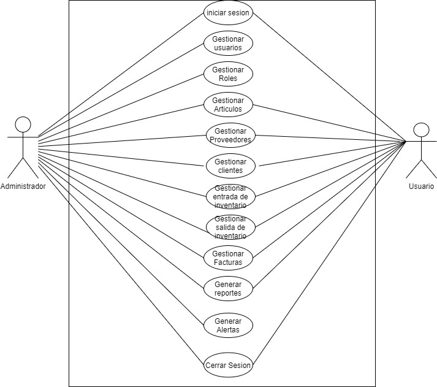
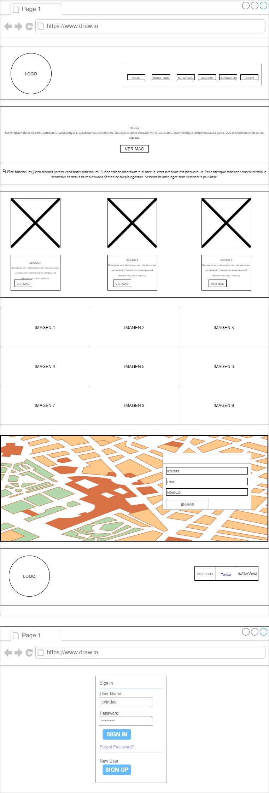
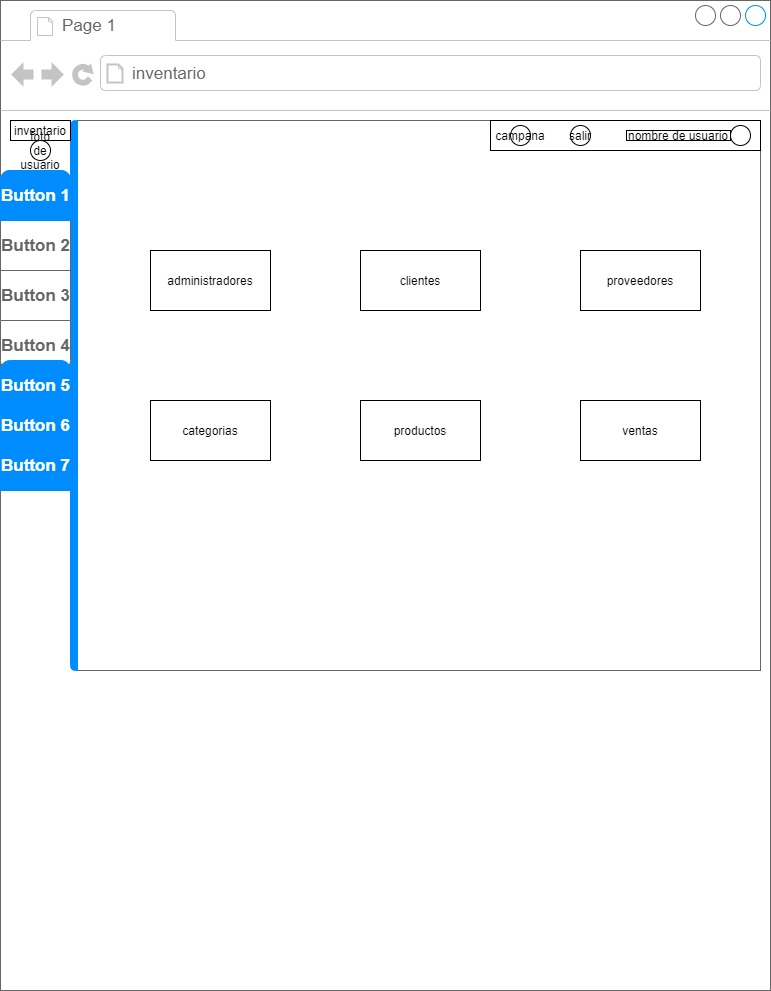

# SISTEMA WEB PARA LE GESTION DE INVENTARIO
## INTRODUCCION
En el presente proyecto, se propone implementar un sistema web para mejorar la gestión de inventario 
facturación, que proporcione a los usuarios, una herramienta que facilite la búsqueda, adquisición,
 venta y facturación de productos y servicios tecnológicos, mediante la utilización de tecnología de 
información y comunicación.

Se encuentra elaborado bajo diseño CSS3, HTML5 y JAVASCRIPT, junto con MYSQL, haciendo 
uso de la arquitectura de tres capas (MVC) que garantiza la calidad en el desarrollo, haciendo que el 
sistema sea robusto, flexible y amigable para el usuario final.

En conclusión, se elaboró la propuesta en base a los juicios y fundamentos obtenidos de la 
observación del proceso al momento de facturar en la empresa y la opinión de algunos usuarios los 
que serán quienes utilicen el sistema, se recogió sus opiniones a través de una entrevista aplicada 
para realizar el proyecto de mejor manera identificando aspectos que sirvan para esquematizar, 
diseñar e implementar el sistema propuesto y que garantice la usabilidad y facilidad del mismo a 
largo plazo.
## FUNCIONALIDADES PRINCIPALES
Generación alerta de existencias y existencias críticas para el reabastecimiento.
## Casos de uso

## Maqueta del proyecto

## url del repositorio
https://github.com/atorrico69/proyecto1.git
